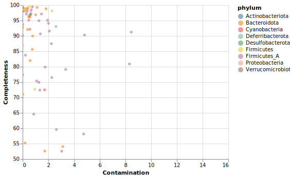

# Metagenome-Atlas Tutorial for ECCB


This is a tutorial for Metagenome-Atlas at ECCB. [Metagenome-Atlas](https://metagenome-atlas.github.io/) is an easy-to-use pipeline for analyzing metagenomic data. It handles all steps from QC, Assembly, Binning, to Annotation.


:interrobang: If you have any question or errors write an [GitHub issues](https://github.com/metagenome-atlas/Tutorial/issues) or try to contact us via the conference platform chat.


## Tutorial part 1: What can you get out of Atlas?
*Analyze the output of Atlas*



Usually before starting to install a program I want to make sure that it gives the output I want.
Therefore, we start analyzing the output of Metagenome-Atlas.
In part 2 of the Tutorial you learn how to run metagenome atlas on some test data or on your own.

### Example output of Metagenome Atlas
A real Metagenome-Atlas run can take more than a day. Therefore we have you prepared some output of a previous run the [Example](Example) folder.  
:sparkles:[This cool report](http://htmlpreview.github.io/?https://github.com/metagenome-atlas/Tutorial/blob/master/Example/Results/Summary.html):sparkles: shows the most interesting output of Atlas.

Here are some questions that guide you through the Atlas output files:

* The main goal of atlas is to create metgenome assembled genomes (MAGs). The genomes are in the folder `genomes/genomes`. How many are there?

* The Taxonomy is based on the Genome Taxonomy Database (GTDB) which tries to be consistent with genome distances. The taxonomy can be found in `Results/taxonomy.tsv`. Which is the phylum with the most genomes? How many species are new/unnamed?

* MAGs are usually not complete or can contain some contamination. Atlas estimates the quality of genomes using checkM. Which is the species with the highest completeness and lowest quality? (You can zoom in in the plot in the summary report).

* Quantification is based on mapping the reads to the genomes using bbmap. Do you think the mapping rate is good? If reads from the host (Mouse) would have been filtered out do you think the mapping rate would be higher?

* The output is based on 15 samples from mice fecal samples from the project PRJEB7759. 8 of them were fed a high fat diet and got obese. Can you see the difference between the groups in the PCA?

*  We use the median coverage over the genomes to calculate the relative abundance. What is the most abundant species in these metagenomes?

* Functional annotation is based on the output of EggNOG mapper of all the genes. Using the link  between the genes and the genomes we can calculate which function is present in which genome (`genomes/gene2genome.tsv.gz`). Finally, the relative abundance of functions (`Results/annotations`).


Metagenome-Atlas produces a lot of other outputs from the QC and assembly steps. They are  summarized reports such as these ones:
- [QC_report](https://metagenome-atlas.readthedocs.io/en/latest/_static/QC_report.html)
- [assembly report](https://metagenome-atlas.readthedocs.io/en/latest/_static/assembly_report.html).


### Run script for differential abundance analysis

We prepared a jupyter [notebook](scripts/Differential_abundance.ipynb) with the code for differential analysis. The goal is to find out which changes are associated with High fat diet induced obesity in mice. To analyze the data, we will install some python packages.  


#### Setup

The part of the tutorial works on linux and macOS and maybe on Windows.  You need to install the [conda package manager](https://metagenome-atlas.readthedocs.io/en/latest/usage/getting_started.html#setup). Download this repo with git or download it as [zip archive](https://github.com/metagenome-atlas/Tutorial/archive/master.zip) and extract it.

```
git clone https://github.com/metagenome-atlas/Tutorial.git
cd Tutorial
```

The script use various python package for analyzing and plotting. Set them up by running

```
cd scripts
./setup.sh
```

This creates a conda-environment in order not to interfere with other software on your computer.
Activate the environment by running, then start jupyter:

```
conda activate analyze
jupyter lab
```


Click on the `Differential_abundance.ipynb` and start the differential analysis.

If something doesn't work, [let us know](https://github.com/metagenome-atlas/Tutorial/issues). You can always have a look at the [notebook](scripts/Differential_abundance.ipynb) to see what would be the output.


## Tutorial part 2: Let's get serious!
*Install and run metagenome Atlas*

In the second part of the tutorial you will install metagenome-atlas on your system and test it with a small dataset.
As real metagenomic assembly can take more than 250GB ram and multiple processors, you would ideally do this directly on a high-performance system, e.g. the cluster of your university. You can install [minconda](https://docs.conda.io/en/latest/miniconda.html) in your home directory if it is not installed on your system.

[Follow this link](https://metagenome-atlas.readthedocs.io/en/latest/usage/getting_started.html#install-metagenome-atlas)

If you want only do the test dataset, you can do most steps on a  normal laptop (Mac or Linux).
